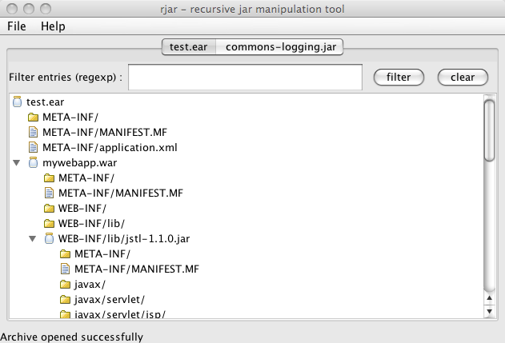

# rjar : Recursive Java Archive (jar) Tool

`rjar` is a command-line tool that acts like the regular `jar` tool, but _recursively_ ! It is very useful when e.g. using .ear or .war files, or any other "jars of jars"...

> Also works zith .zip files !

Supported features :

* _list jar entries recursively_ : all entries are displayed including entries of nested jars if any
* _expand a jar recursively_ : expand the jar and its nested jars to the specified directory
* _recreate a jar from an expanded rjar_ : allows to rebuild a jar with nested jars from an expanded directory structure
* _graphical front-end_ : tree view of your jars, with regexp filtering

## Install

Download binary distribution :

* [.zip](https://repo1.maven.org/maven2/com/pojosontheweb/rjar/0.6.1/rjar-0.6.1-bin.zip) 
* [.tar.gz](https://repo1.maven.org/maven2/com/pojosontheweb/rjar/0.6.1/rjar-0.6.1-bin.tar.gz) 

Unpack wherever you want, and follow instructions in `<unpack_dir>/README.txt`.


## Examples

List the contents of an ear :

```
$ rjar t ./projects/jarutils/src/test/resources/test.ear 
test.ear/META-INF/
test.ear/META-INF/MANIFEST.MF
test.ear/META-INF/application.xml
test.ear/mywebapp.war/
test.ear/mywebapp.war/META-INF/
test.ear/mywebapp.war/META-INF/MANIFEST.MF
test.ear/mywebapp.war/WEB-INF/
test.ear/mywebapp.war/WEB-INF/lib/
test.ear/mywebapp.war/WEB-INF/lib/jstl-1.1.0.jar/
test.ear/mywebapp.war/WEB-INF/lib/jstl-1.1.0.jar/META-INF/
test.ear/mywebapp.war/WEB-INF/lib/jstl-1.1.0.jar/META-INF/MANIFEST.MF
test.ear/mywebapp.war/WEB-INF/lib/jstl-1.1.0.jar/javax/
test.ear/mywebapp.war/WEB-INF/lib/jstl-1.1.0.jar/javax/servlet/
test.ear/mywebapp.war/WEB-INF/lib/jstl-1.1.0.jar/javax/servlet/jsp/
test.ear/mywebapp.war/WEB-INF/lib/jstl-1.1.0.jar/javax/servlet/jsp/jstl/
test.ear/mywebapp.war/WEB-INF/lib/jstl-1.1.0.jar/javax/servlet/jsp/jstl/core/
test.ear/mywebapp.war/WEB-INF/lib/jstl-1.1.0.jar/javax/servlet/jsp/jstl/fmt/
test.ear/mywebapp.war/WEB-INF/lib/jstl-1.1.0.jar/javax/servlet/jsp/jstl/sql/
test.ear/mywebapp.war/WEB-INF/lib/jstl-1.1.0.jar/javax/servlet/jsp/jstl/tlv/
test.ear/mywebapp.war/WEB-INF/lib/jstl-1.1.0.jar/javax/servlet/jsp/jstl/core/ConditionalTagSupport.class
...
```

Extract the whole ear recursively :

```
$ rjar x ./projects/jarutils/src/test/resources/test.ear /tmp
$ find /tmp/test.ear 
/tmp/test.ear
/tmp/test.ear/META-INF
/tmp/test.ear/META-INF/application.xml
/tmp/test.ear/META-INF/MANIFEST.MF
/tmp/test.ear/mywebapp.war
/tmp/test.ear/mywebapp.war/META-INF
/tmp/test.ear/mywebapp.war/META-INF/MANIFEST.MF
/tmp/test.ear/mywebapp.war/test.jsp
/tmp/test.ear/mywebapp.war/WEB-INF
/tmp/test.ear/mywebapp.war/WEB-INF/lib
/tmp/test.ear/mywebapp.war/WEB-INF/lib/jstl-1.1.0.jar
/tmp/test.ear/mywebapp.war/WEB-INF/lib/jstl-1.1.0.jar/javax
/tmp/test.ear/mywebapp.war/WEB-INF/lib/jstl-1.1.0.jar/javax/servlet
/tmp/test.ear/mywebapp.war/WEB-INF/lib/jstl-1.1.0.jar/javax/servlet/jsp
/tmp/test.ear/mywebapp.war/WEB-INF/lib/jstl-1.1.0.jar/javax/servlet/jsp/jstl
/tmp/test.ear/mywebapp.war/WEB-INF/lib/jstl-1.1.0.jar/javax/servlet/jsp/jstl/core
/tmp/test.ear/mywebapp.war/WEB-INF/lib/jstl-1.1.0.jar/javax/servlet/jsp/jstl/core/ConditionalTagSupport.class
...
```

Rebuild a previously expanded (r)jar :

```
$ rjar r /tmp/test.ear /tmp/recreated
$ ls /tmp/recreated
test.ear
```

As any other command line utility, rjar can be combined with other unix commands. Here's how you can find a particular class in a set of jar files :

```
$ cd $ECLIPSE_HOME
$ find . -name *.jar -exec rjar t {} \; | grep plugin.properties
com.ibm.icu_3.6.1.v20070906.jar/plugin.properties
com.jcraft.jsch_0.1.31.jar/plugin.properties
javax.servlet.jsp_2.0.0.v200706191603.jar/plugin.properties
javax.servlet_2.4.0.v200706111738.jar/plugin.properties
javax.wsdl_1.4.0.v200706111329.jar/plugin.properties
...
```

You can also use the GUI front end to open the jar(s) in a tree view :

```
$ rjar ui ./test.ear ./commons-logging.jar
```



Entries list can be filtered using regexp :


## From Groovy

`rjar` is implemented as a set of Groovy classes. It basically augments the `JarFile` class from the JDK, via a Category class, adding methods to crawl the jar file recursively.

Maven dependency :

```
<dependency>
  <groupId>com.pojosontheweb</groupId>
  <artifactId>rjar</artifactId>
  <version>...</version>
</dependency>
```
 
Usage : 


```
import com.rvkb.util.jar.*

JarFile jar = new JarFile(new File(pathToJar))

use(JUJarCategory) {


	jar.eachEntry { JUJarEntry entry ->
		...
	}

	jar.eachEntryRecursive { JUJarEntry entry ->
		...
	}
}
```

Api docs can be found [here](http://jdp.rvkb.com/api/rjar/index.html).


(c) [pojosontheweb.com](http://pojosontheweb.com)


